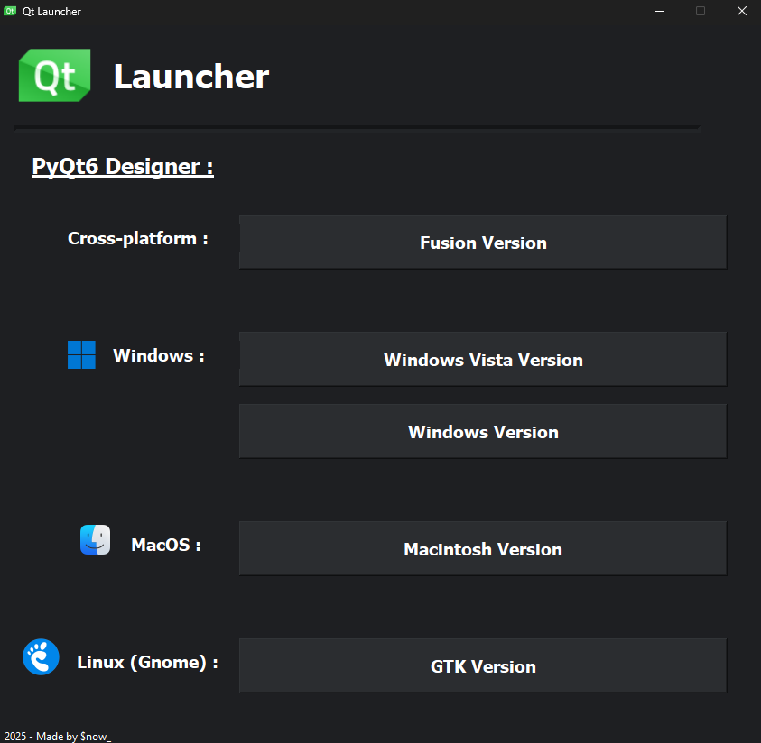

# PyQt-Launcher

<h3>Here is the code for PyQt Launcher. With this application, you can open the designer application and choose the style of your next GUI.</h3>
<br>

<div align="center">
    
</div>
<br>

<hr style="height:2px; background-color:gray; border:none;">
<br>

<h4>First stage :</h4>
To open the designer application, you'll need to find the path to the executable. Here is what should be the executable path depending of your OS :
<br><br>
Windows :

```shell
<python_installation>\Lib\site-packages\qt6_applications\Qt\bin\designer.exe
```
MacOS / Linux :
```shell
<python_installation>/lib/python<version>/site-packages/qt6_applications/Qt/bin/designer
```
<br><br>
Then, you'll need to write the path to your own PyQt Designer executable in <code>config.json</code> :
<br><br>

```json
{
  "qt-designer_path": "path\\to\\your\\py-qt\\designer\\executable",
  "comment": "Change the qt-designer_path with your own path which goes to the PyQt Designer executable, see the README.md for more informations"
}
```
<br>

<hr style="height:2px; background-color:gray; border:none;">
<br>
<h4>Second stage :</h4>
Run the script <code>main.py</code> and enjoy...
